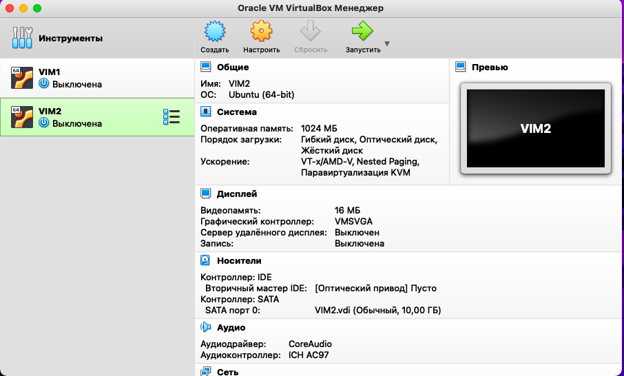
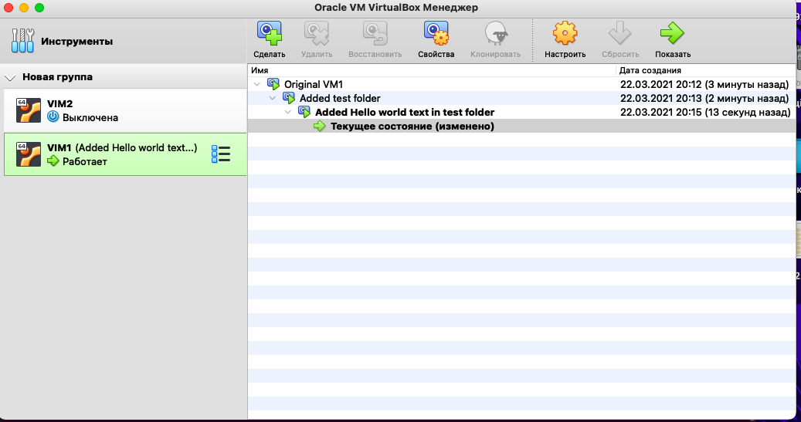

Part 1

	1. The most popular hypervisors are VirtualBox, KVM, Oracle, Hyper -V. Each of them has advantages and disadvantages over each other

	2. VMware is the most expensive solution, Hyper-V is cheaper (or, when using Hyper-V Server and Linux virtual machines, it is generally free), KVM is initially free.
		Hyper-V Server is especially for those who do not want to pay for a hardware virtualization system 		Cons:
		All virtual machines running Windows must be licensed.
		There is no graphical interface, however, there is a remote console.
	VMware uses Storage DRS to balance loads between host resources
		 
Part 2

Cloned VM1 to VM2

Created group and snapshots of VM1

