						Virtualization and Cloud Basic
1 - 3. Registered on AWS and explored some tutorials in Youtube. 
4. Launched Virtual Machine with Amason Lightsail.
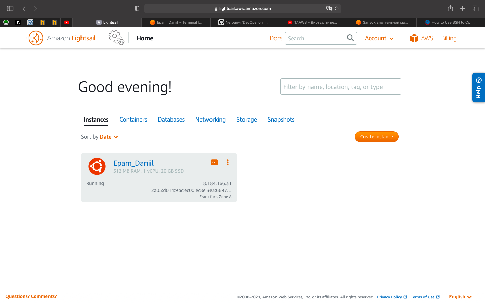
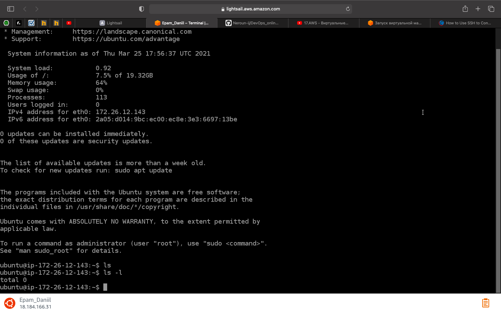 
5. Launched Virtual Machine using EC2
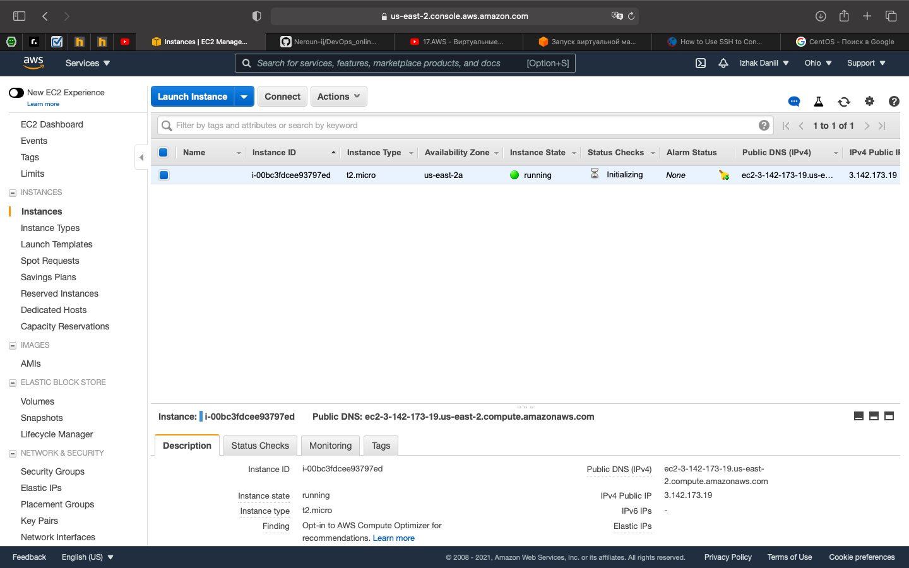 
6. Created snapshot of my instance
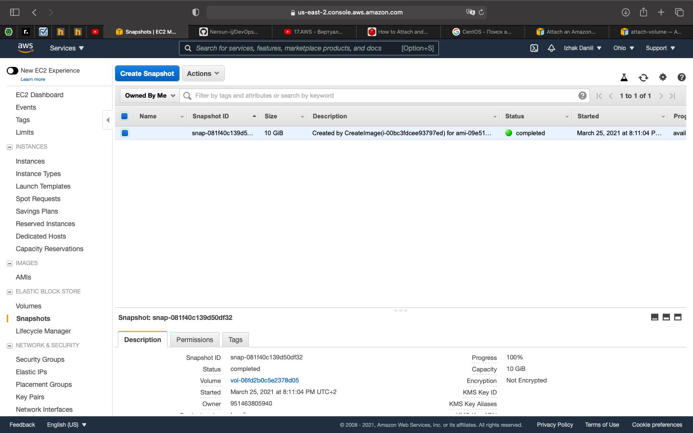
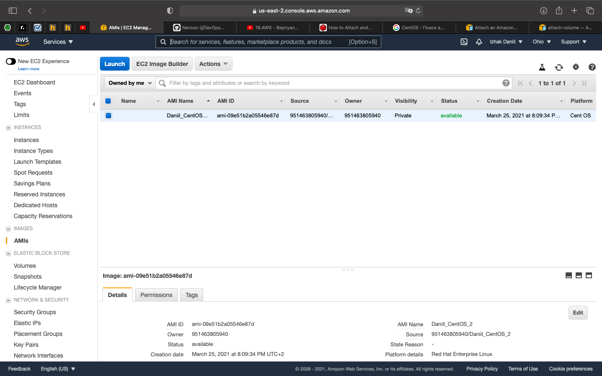 
7. Created and attached Disk_D 
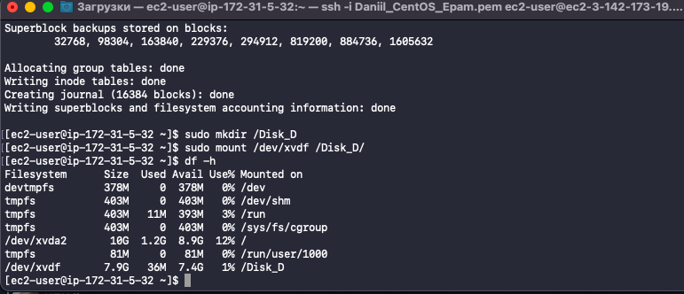
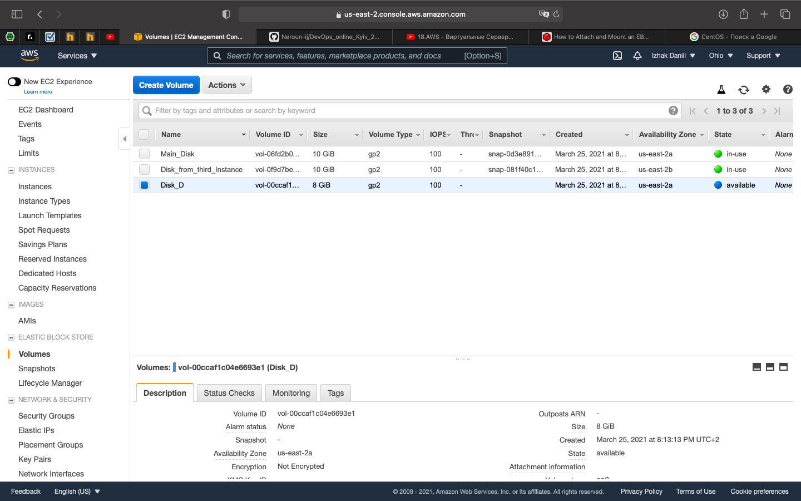 
8. Launched third instance from Backup
 
9. Attached Disk_D to the new instance
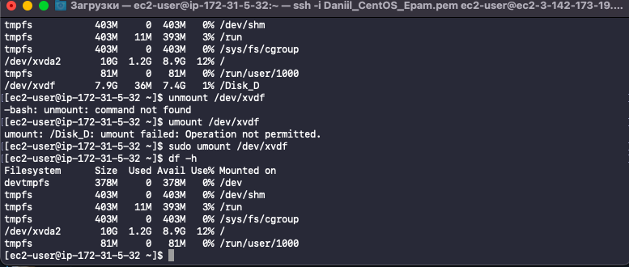
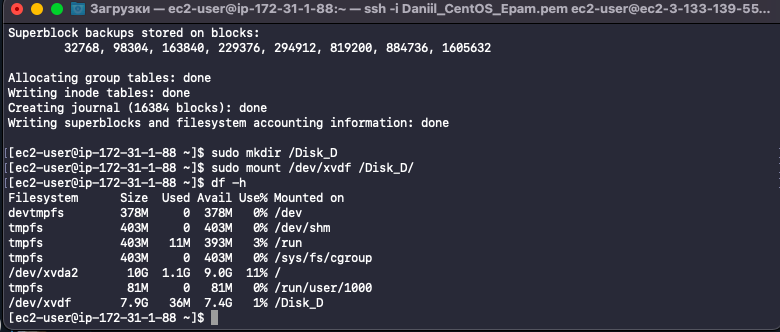 
10. Created WordPress using Amason Lightsail
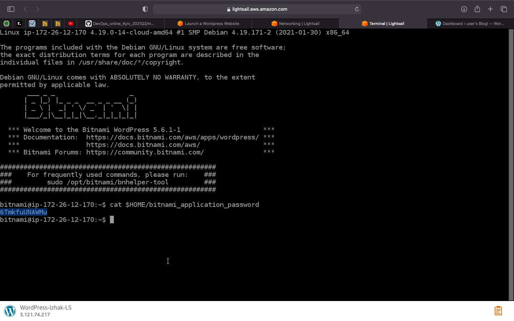 
11. Created my own repository using S3 (store and retrieve file) 
12. Some actions using AWS CLI. Also, created user with AWS IAM and uploaded some files to S3.
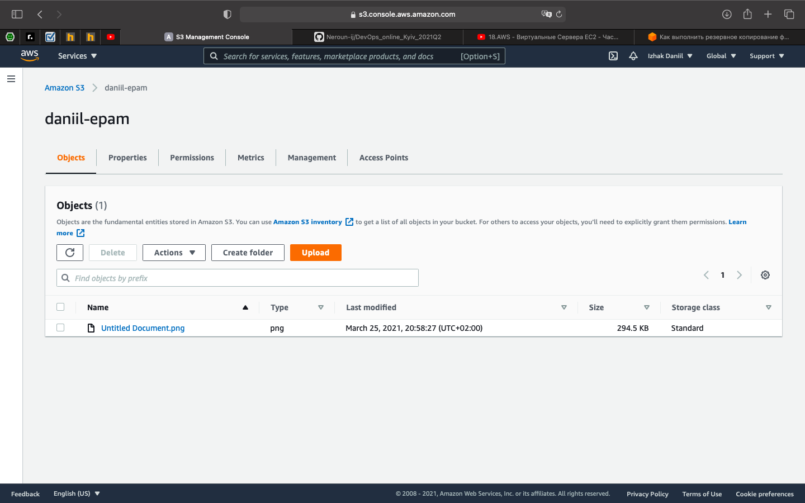
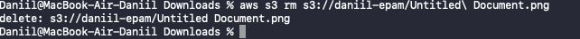
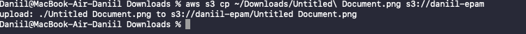 
13. Explored the possibiliities of creating own domain and domaine name for mine site with AWS Route 53.
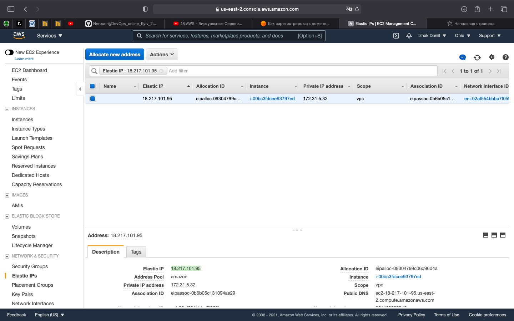\
14. Deployed Docker Containers on Amazon Elastic Container Service (Amazon ECS).
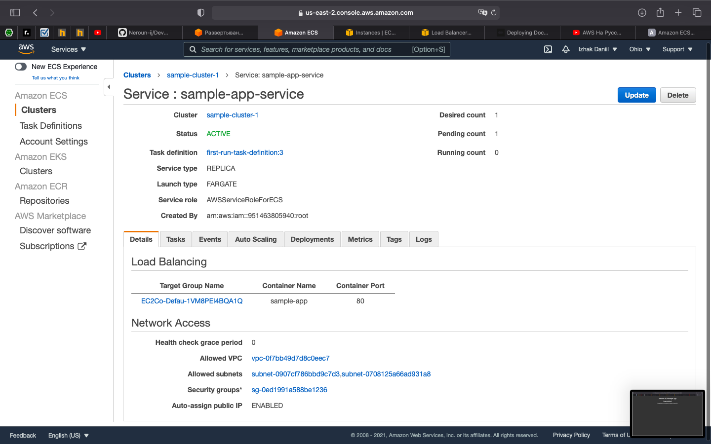
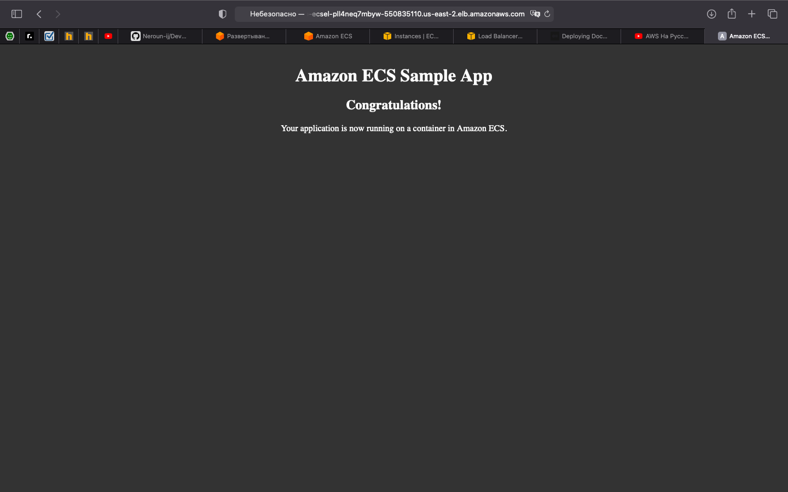

15. Created a static website on Amazon S3 with the completed AWS labs and services which i worked within the educational program and earlier. 

[http://izhak-epam-task2.2.s3-website.us-east-2.amazonaws.com](http://izhak-epam-task2.2.s3-website.us-east-2.amazonaws.com)
