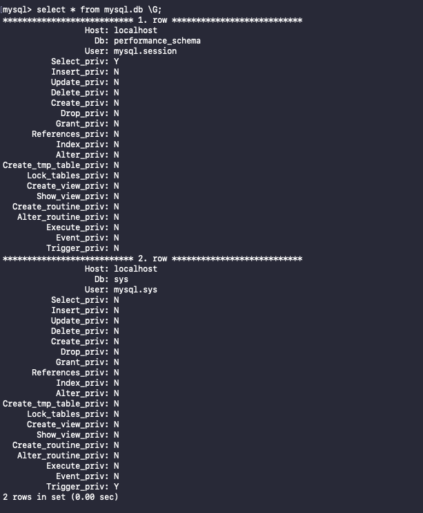

                                                DATABASE ADMINISTRATION
                                                -----------------------

Part 1
---

1 - 2 Downloaded and installed MySQL Server on my EC2 instance.

3. My subject area is university and it includes three tables: study, students, cafeteria :)

4 - 5 Created and filled my DATABASE

6. Executed operator SELECT with WHERE, GROUP BY and ORDER BY.

SELECT + WHERE:

SELECT + GROUP BY:

SELECT + ORDER BY:

7. Executed other different SQL queries.

DDL:

DML:

More DCL cmd in next step introduced 

8. Created a new user with different privileges. Also, verified that privileges work.

Verified first privilege:

Verified second privilege:

And the last one:

9. Selection from the main DB MYSQL.

Part 2
---

10 - 12 Made backup of my DATABASE, deleted table study and then restored DB.

13 - 16 Transferred local DB, connected and executed SELECT cmd in mine RDS DB.

Part 3
---

17 - 18 Created DynamoDB table and entered data using AWS CLI.

19. Query and Scan cmd.

Query:

Scan:

Thanks! Have a good day ;)
---
