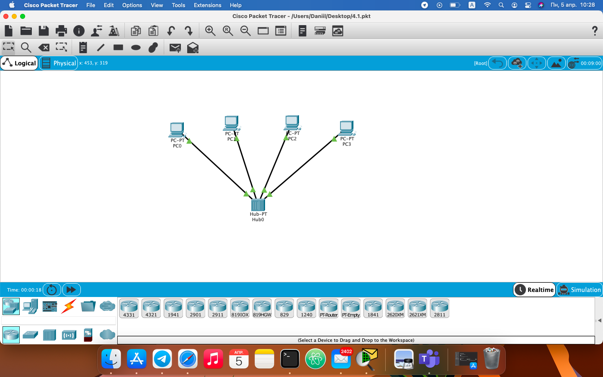
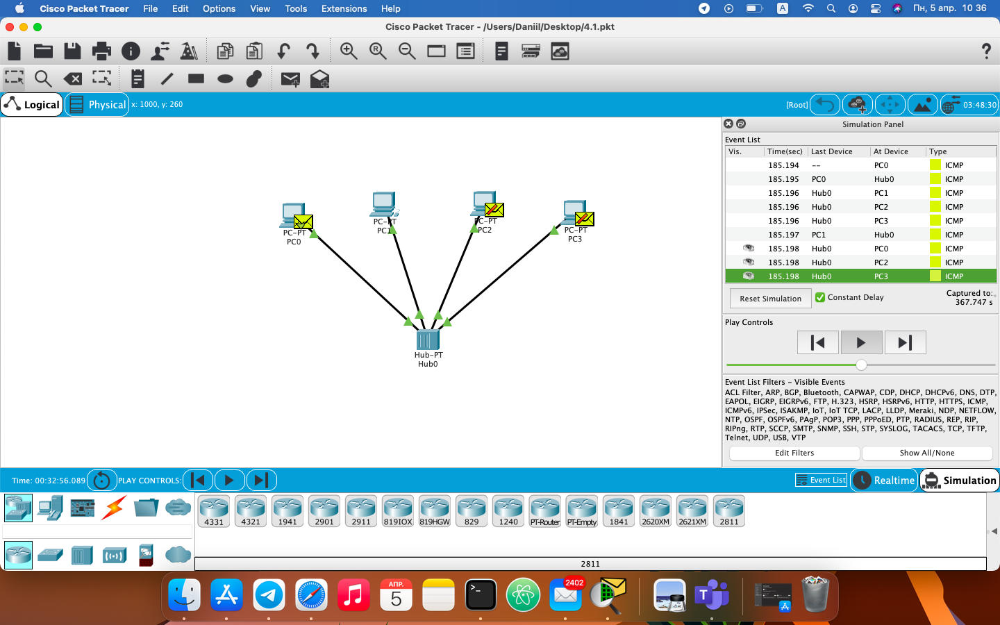
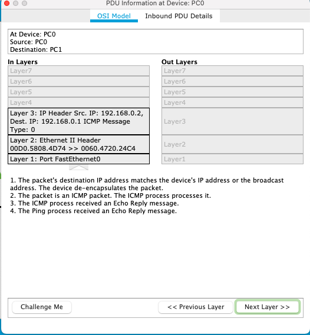
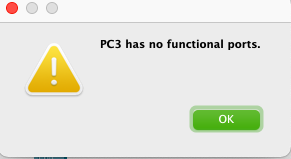
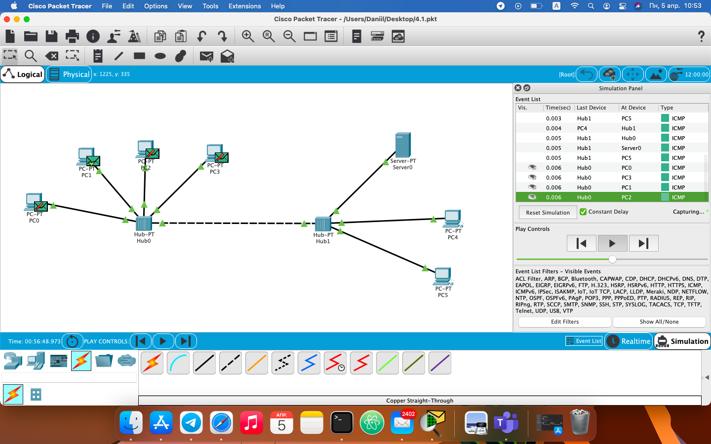
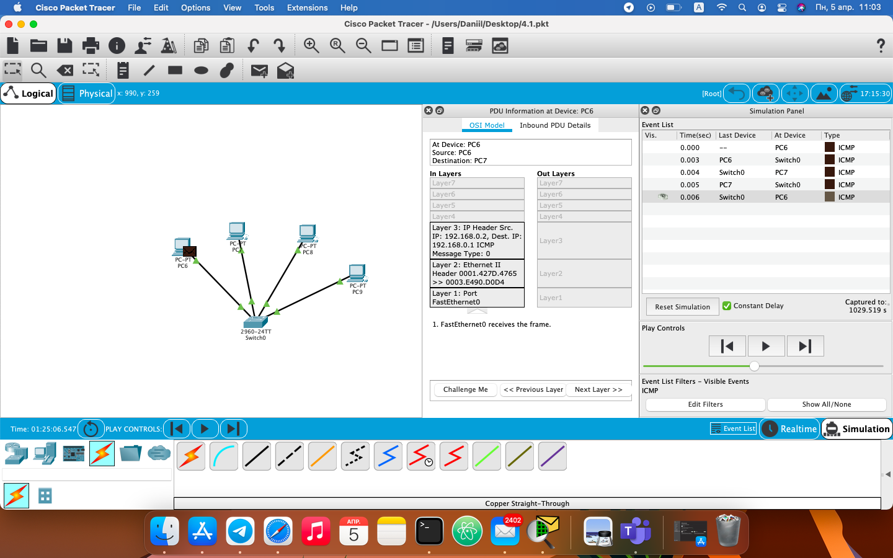
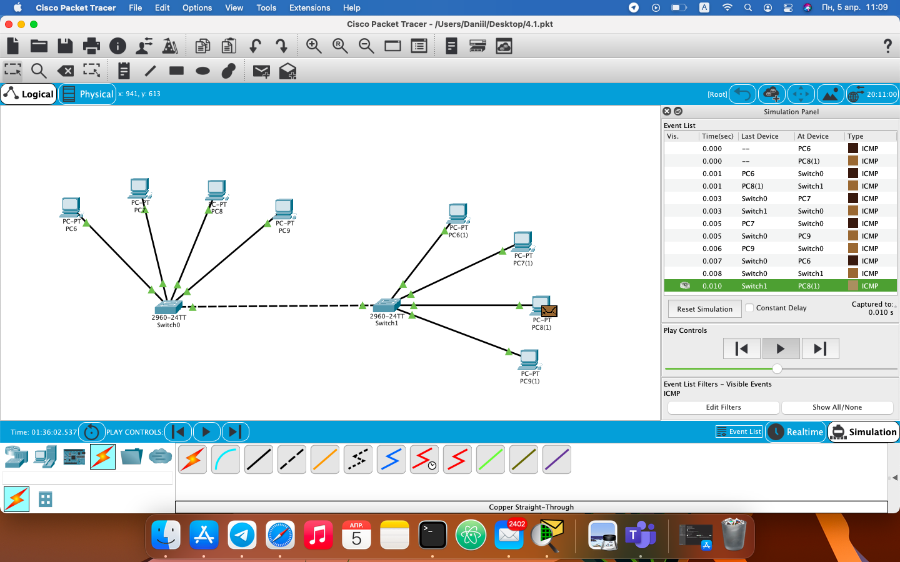
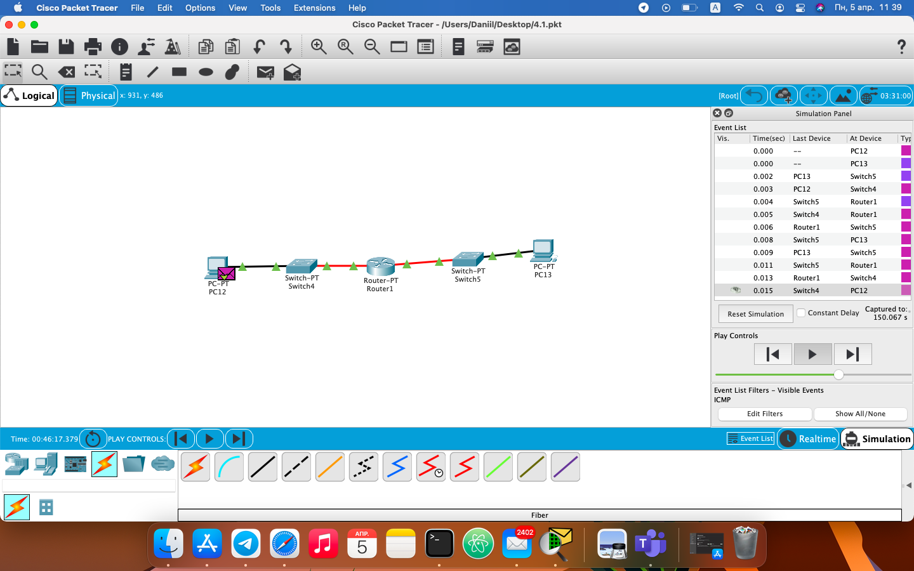

                                          Networking Fundamentals
                                          -----------------------

1 - 2. Created project with 4 PC's and Hub.

4 - 7. Checked simulation and how ICMP packet goes from one PC to another.

8. Repeated process, but now without ip on PC's.

9. Created project with 5 PC's, 2 Hubs and Server and checked the network perfomance.

10. Created project with 4 PC's and switch.

11. Then added 4 more PC's and switch.

12. After that, created project with two different subnets using router.

The conclusion is that we learned how to create the simplest networks and visually monitored the processes of how packets are transmitted between different PCs.  We also distinguish now between a hub, a switch and a router.  A hub is the simplest device that we send packets to everyone, even to those who don't need it :)  The switch is smarter and already knows who exactly needs this data, and the router helps us connect different subnets in order to communicate with other PCs.
