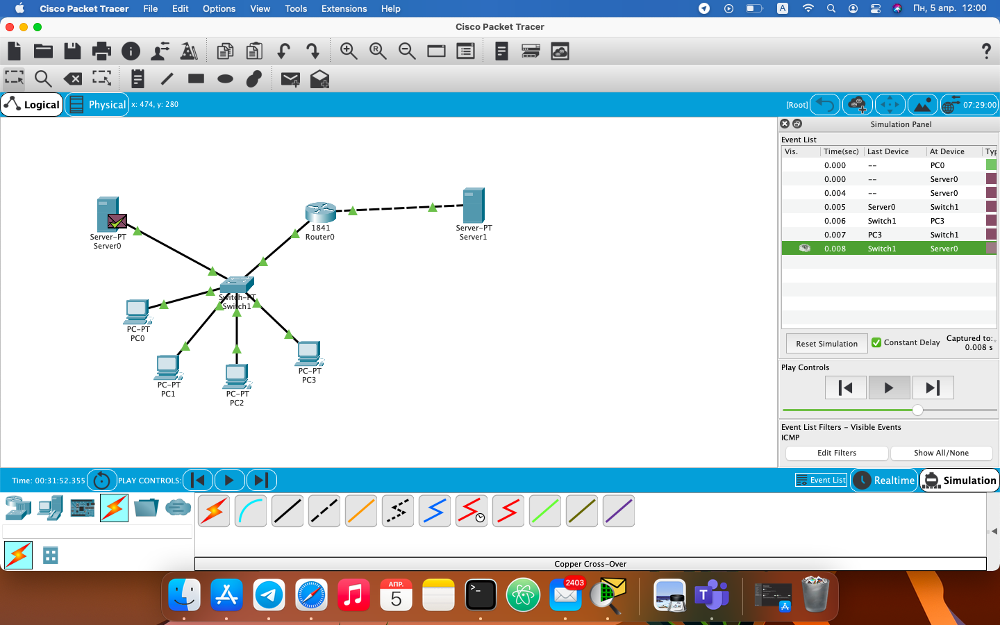
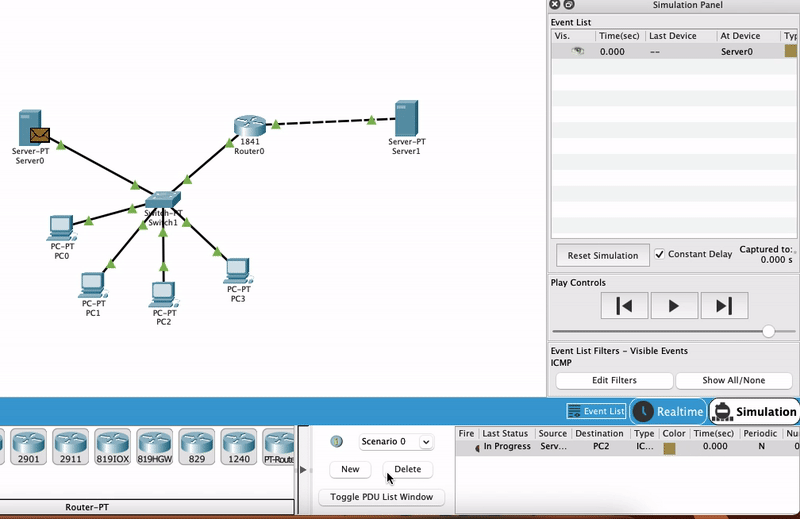

                                              Networking Fundamentals
                                              -----------------------
1 - 4 Created local network with 5 PC's, switch, server and router using RIP protocol.

                                         

